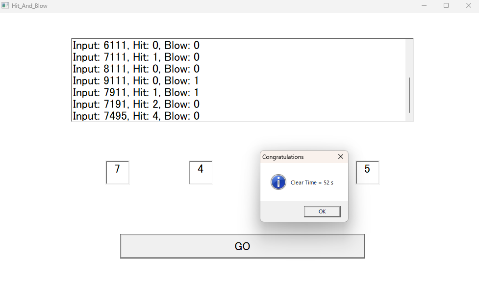

## Hit & Blow Game (C++ / Win32 API)
ヒット＆ブローゲームを Win32 API (Windows11の仮想環境WSL/Ubuntu)で作りました。

## 概要 --------------------------------------
- Hit & BlowのWindows向けGUIアプリケーションです。
- Win32 API を使いウィンドウアプリケーションを作成したかったため取り組みました。

## 特徴 --------------------------------------
- ランダム生成で数値が4桁のお題が作られます。
- ヒット数・ブロー数付きで入力履歴がリストボックスに表示されます。
- 入力欄に全ての数字が埋まってないとエラーが表示されます。
- クリアタイムが表示されます(秒,ミリ秒)
- enumを用いて入力欄を ID_EDIT1~ID_EDIT4　決定ボタン ID_BUTTON_DECIDE　入力履歴を ID_LIST_HISTORY　を決め、
　開発する際に分かりやすいものとなるようにしています。

## 実際の画面 --------------------------------
- ゲーム開始-

- 数字考察画面-

- 特定完了後-

- クリアタイム表示 -

- 文字が少ないとエラー表示 -

- この後OK押すとまたランダム生成される-

## 動作環境と前提
！Windows11の仮想環境Ubuntuでしか実行したことないので、出来るか分かりません！
- Windows 10/11 (64bit)
- MinGW-W64 (x86_64)
- C++17

## 今度の改善案
- 難易度選択を可能
- スコアを追加してゲーム性を上げたい -> タイムを追加してタイムアタックできるようにしました。
- マウスだけで操作

## ライセンス

MIT License © 2025 Homu

## 更新履歴
- 2025/07/31 ver.(1.1) タイムを追加しました。
